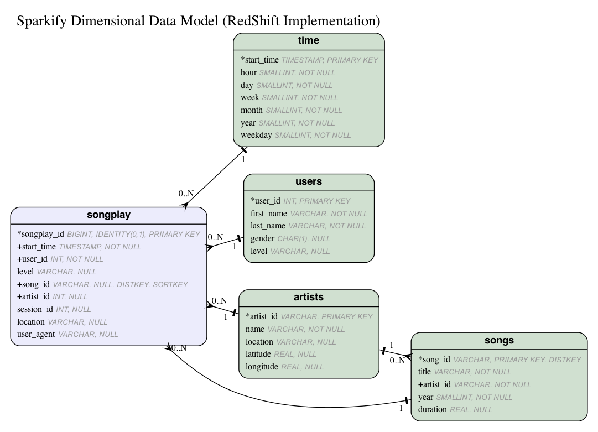

# Data Warehouse
In this project, we will acreate a data warehouse by using AWS and build an ETL pipeline for a database hosted on Redshift.

We will need to load data from S3 to staging tables on Redshift and execute SQL statements that create the analytics tables from these staging tables.

# Introduction
A music streaming startup, Sparkify, has grown their user base and song database and want to move their processes and data onto the cloud. Their data resides in S3, in a directory of JSON logs on user activity on the app, as well as a directory with JSON metadata on the songs in their app.

As their data engineer, you are tasked with building an ETL pipeline that extracts their data from S3, stages them in Redshift, and transforms data into a set of dimensional tables for their analytics team to continue finding insights in what songs their users are listening to. You’ll be able to test your database and ETL pipeline by running queries given to you by the analytics team from Sparkify and compare your results with their expected results.

Created a database warehouse utilizing Amazon Redshift. Skills include:

Creating a Redshift Cluster, IAM Roles, Security groups.

Develop an ETL Pipeline that copies data from S3 buckets into staging tables to be processed into a star schema

Developed a star schema with optimization to specific queries required by the data analytics team.

Proficiencies used: Python, Amazon Redshift, aws cli, Amazon SDK, SQL, PostgreSQL

# Design Decisions

Utilized psql COPY comand to quickly load data into staging tables. Example from staging_events:

``COPY staging_events 
FROM 's3://udacity-dend/log_data'
IAM_ROLE 'DWH_IAM_ROLE_NAME'
REGION 'us-west-2' compupdate off 
JSON 's3://udacity-dend/log_json_path.json';``

# Dimensional Model & ETL
Data is extracted from staging tables and inserted into the dimensional model shown below.

# Files 

Create_tables.py - used to create staging tables, and star schema tables for data to be copied to

sql_queries.py - has all sql queries and copy to queries for data to be loaded into redshift

etl.py - executes the etl commands to load the data into the redshift database

dwh.cfg - holds all the aws applicable information in order to load information in redshift.
